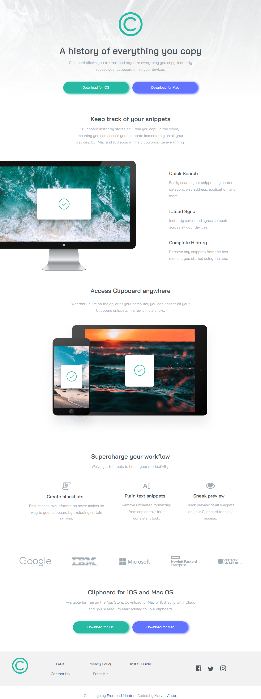

# Frontend Mentor - Clipboard landing page solution

This is a solution to the [Clipboard landing page challenge on Frontend Mentor](https://www.frontendmentor.io/challenges/clipboard-landing-page-5cc9bccd6c4c91111378ecb9). Frontend Mentor challenges help you improve your coding skills by building realistic projects. 

## Table of contents

- [Overview](#overview)
  - [The challenge](#the-challenge)
  - [Screenshot](#screenshot)
  - [Links](#links)
- [My process](#my-process)
  - [Built with](#built-with)
- [Author](#author)

## Overview

### The challenge

Users should be able to:

- View the optimal layout for the site depending on their device's screen size
- See hover states for all interactive elements on the page

### Screenshot

- Desktop Solution Screenshot

- Mobile Solution Screenshot

### Links

- Frontend Mentor Solution URL: [Frontend Mentor Solution Page](https://www.frontendmentor.io/solutions/clipboard-landing-page-with-scss-tdmvueuwZd)
- Live Site URL: [Live Hosted Website](https://mharvel13.github.io/Clipboard-Landing-Page/)
- Github Solution URL: [Github Hosted Codes](https://github.com/Mharvel13/Clipboard-Landing-Page)

## My process

### Built with

- Semantic HTML5 markup
- CSS custom properties
- Flexbox
- SASS
- Mobile-first workflow

## Author

- GitHub Profile - [Mharvel13](https://github.com/Mharvel13)
- Frontend Mentor - [Marvel Victor](https://www.frontendmentor.io/profile/Mharvel13)
- Twitter - [Marvel](https://twitter.com/Mharvel_O)